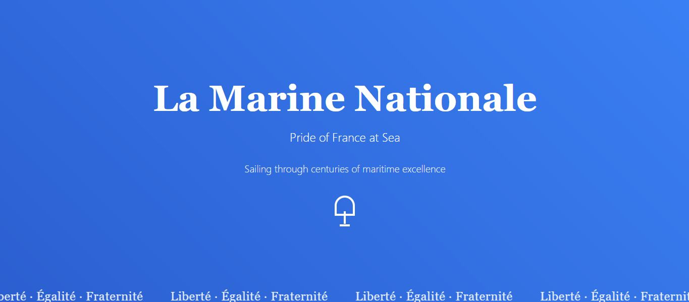

# La Marine Nationale: Pride of France at Sea⚓

A single-page website celebrating the rich history and modern capabilities of the French Navy, crafted with a focus on elegant design and smooth user experience.

---

## ✨ Features

* **Dynamic Hero Section:** A striking introduction with a gradient ocean background and an endlessly flowing banner displaying "Liberté · Égalité · Fraternité".
* **Historical Journey:** Explore a curated timeline highlighting pivotal moments in French naval history.
* **Modern Fleet Showcase:** Discover the advanced vessels that constitute France's contemporary maritime power.
* **Charles de Gaulle:** An in-depth look at the iconic nuclear-powered aircraft carrier.
* **Interactive Elements:**
    * **Scroll Progress Bar:** A subtle indicator at the top tracking your reading progress.
    * **Smooth Animations:** Engaging fade-in and slide-in effects for content as you scroll.
    * **Responsive Design:** Flawlessly adapts to various screen sizes, from mobile devices to large desktops.

## 🛠️ Technologies Used

* **HTML5:** The structural backbone of the website.
* **Tailwind CSS:** A utility-first CSS framework for rapid and consistent styling.
* **Custom CSS:** Hand-crafted keyframe animations for dynamic visual effects.
* **JavaScript:** Powers the interactive elements, including scroll tracking and content animations.

## 🚀 Getting Started

To view this website locally or deploy it:

### Local Setup

1.  **Clone the repository:**
    ```bash
    git clone [https://github.com/AryanKo/La-Marine-Nationale](https://github.com/AryanKo/La-Marine-Nationale)
    ```
2.  **Navigate to the project directory:**
    ```bash
    cd La-Marine-Nationale
    ```
3.  **Open the file:**
    Simply open the `index.html` file in your preferred web browser.

### GitHub Pages Deployment

This website is perfectly suited for hosting with GitHub Pages, offering a free and easy way to publish your site.

1.  **Create a new public GitHub repository** and upload the `index.html` file.
2.  Go to your repository's **`Settings`** tab.
3.  In the left sidebar, click on **`Pages`**.
4.  Under "Build and deployment," select **`Deploy from a branch`**.
5.  Choose your main branch (e.g., `main` or `master`) and set the folder to **`/ (root)`**.
6.  Click **`Save`**.
7.  Your website will typically be live within a few minutes.

## 📸 Preview



---

Proudly created to showcase the enduring legacy of France's maritime power.
